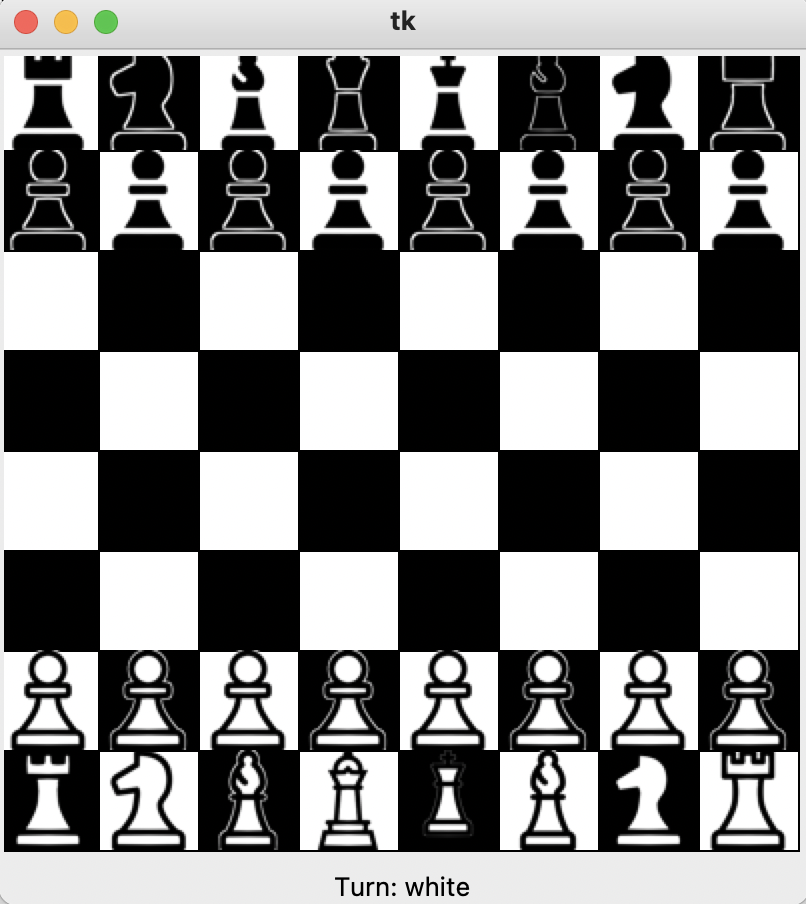

# Work Showcase: Chess Demonstration
In this file I have created 3 primary classes with the aim of playing a game of chess out of them. Each of them addresses a different facet of the game: creating the board and pieces, applying the rules and logic, and creating an interface that the user may play chess through.

## Classes
### Chessboard
In the Chessboard Class, I have written the code to create the board, states, and pieces.

### ChessGame
In the ChessGame Class, I have written the code to move pieces and run logic for a game of chess to be legally played.

### ChessGUI
In the ChessGUI Class, I have written the code for a user-friendly interface to pop up, so that anyone running this code is not remembering the board state through words, but may look at it.

## Game
For those interested in a brief glimpse without running the code, below is a screenshot of the game interface.
